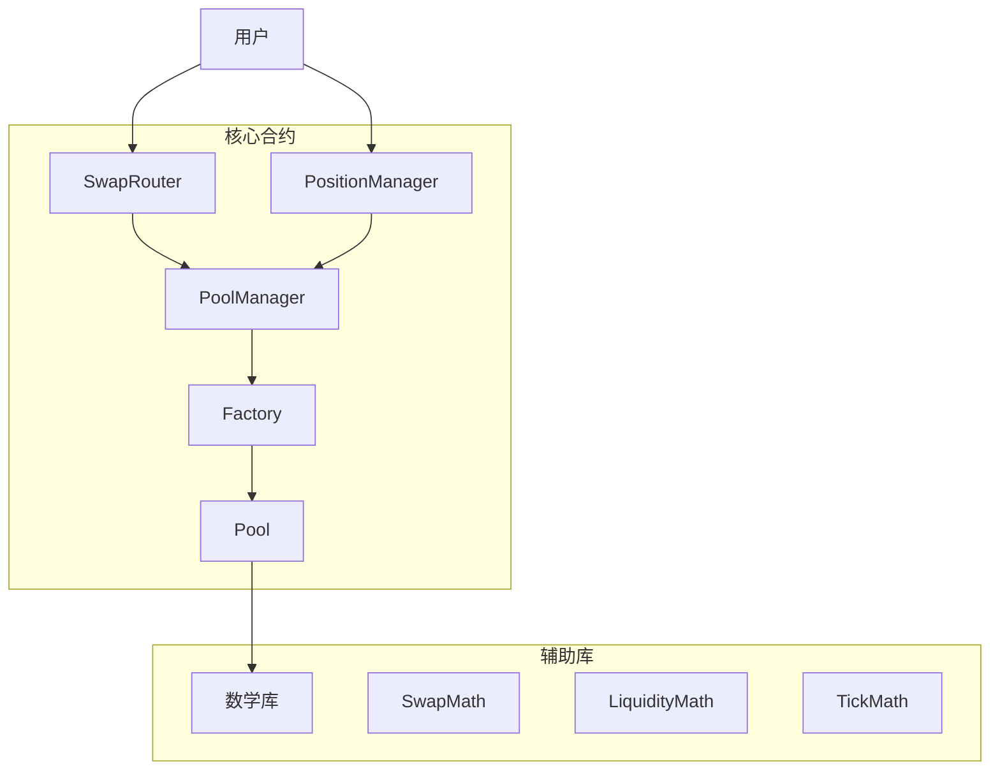

Factory.sol	创建池子，支持多 tick 区间与 fee 档

Pool.sol	价格推进、交易、流动性管理

PoolManager.sol	管理交易对与池子索引

PositionManager.sol	LP 持仓 NFT 化，支持 mint/burn/collect

SwapRouter.sol	用户交易入口，支持 exact-in / exact-out

# 📐 Tick 与价格公式说明

---

## 🧮 Tick 与价格关系

Uniswap V3 使用 tick 来离散化价格区间，tick 与价格之间的关系如下：

- **价格计算公式**：
  

\[
  P = 1.0001^{\text{tick}}
  \]

- **平方根价格（用于合约内部计算）**：
  

\[
  S = \sqrt{P} = \sqrt{1.0001^{\text{tick}}}
  \]

- **编码后的价格（Q64.96 格式）**：
  

\[
  \text{sqrtPriceX96} = \lfloor S \cdot 2^{96} \rfloor
  \]

---

## 💧 添加流动性时的代币数量计算

假设当前价格为 \( \sqrt{P} \)，流动性为 \( L \)，tick 区间为 \( [P_{lower}, P_{upper}] \)，则：

- **token0 所需数量**（价格靠近下界）：
  

\[
  \text{amount0} = \frac{L \cdot (\sqrt{P_{upper}} - \sqrt{P})}{\sqrt{P_{upper}} \cdot \sqrt{P}}
  \]

- **token1 所需数量**（价格靠近上界）：
  

\[
  \text{amount1} = L \cdot (\sqrt{P} - \sqrt{P_{lower}})
  \]

> 注意：当价格处于 tick 区间之外时，某一侧的代币需求为 0。

---

## 🔁 交易过程中的价格推进公式

在交易过程中，价格会在 tick 区间内推进，推进公式如下：

- **token0 换 token1（价格上升）**：
  

\[
  \Delta x = L \cdot \left( \frac{1}{S_{\text{new}}} - \frac{1}{S_{\text{old}}} \right)
  \]

- **token1 换 token0（价格下降）**：
  

\[
  \Delta y = L \cdot (S_{\text{old}} - S_{\text{new}})
  \]

其中：

- \( S_{\text{old}} \)：当前 sqrtPrice
- \( S_{\text{new}} \)：目标 sqrtPrice
- \( L \)：当前 tick 区间内的总流动性

---

## 📌 实用参考

- Tick 步长为 1 时，价格变化约为 0.01%
- Tick 范围越大，价格跨度越广，适合长期持仓
- 精细 tick 控制可实现高效资本利用率

---

> 本文档适用于理解 MetaNodeSwap 与 Uniswap V3 的核心定价机制，可用于开发、审计与优化交易策略。
