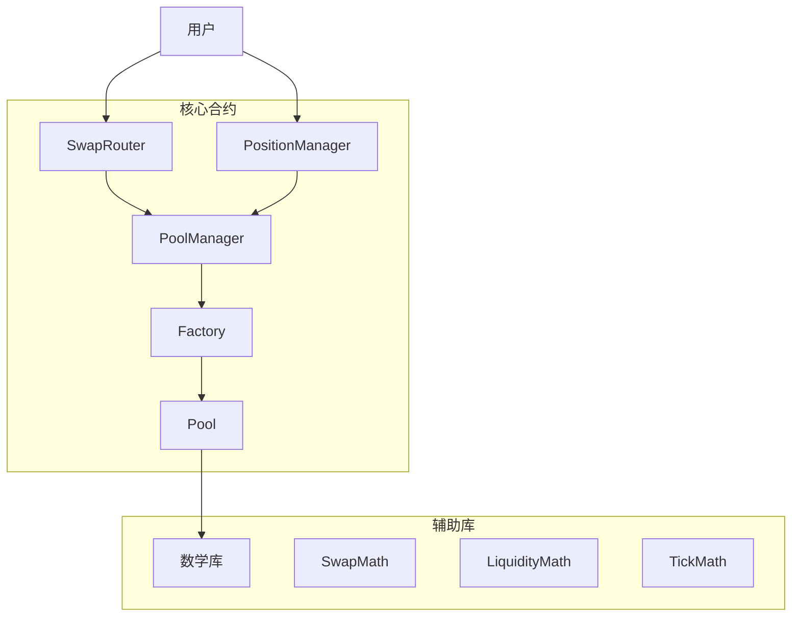

```mermaid
graph TB
    A[用户] --> B[SwapRouter]
    A --> C[PositionManager]
    B --> D[PoolManager]
    C --> D
    D --> E[Factory]
    E --> F[Pool]
    F --> G[数学库]
    
    subgraph "核心合约"
        B
        C
        D
        E
        F
    end
    
    subgraph "辅助库"
        G
        H[SwapMath]
        I[LiquidityMath]
        J[TickMath]
    end
```