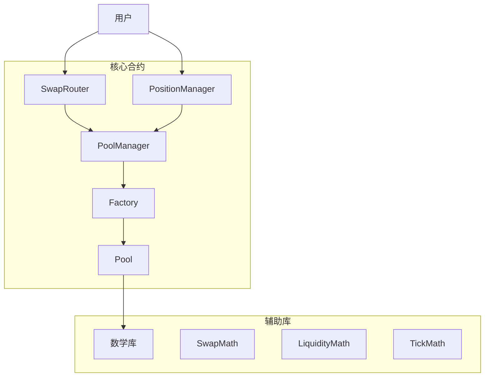

Factory.sol	创建池子，支持多 tick 区间与 fee 档

Pool.sol	价格推进、交易、流动性管理

PoolManager.sol	管理交易对与池子索引

PositionManager.sol	LP 持仓 NFT 化，支持 mint/burn/collect

SwapRouter.sol	用户交易入口，支持 exact-in / exact-out

# MetaNodeSwap / Uniswap V3 核心数学公式详解

本文档旨在梳理和解释 MetaNodeSwap 项目（基于 Uniswap V3 模型）背后最核心的数学公式。理解这些公式是掌握集中流动性 AMM 工作原理的关键。

---

### 1. 价格 (Price) 与刻度 (Tick) 的关系

为了在链上高效地表示和管理离散的价格范围，Uniswap V3 引入了“刻度”（Tick）的概念。价格和 Tick 之间通过对数关系进行转换。

#### 1.1 从 Tick 计算价格

每个 Tick 索引 `i` 对应一个特定的价格 `P`。价格 `P` 定义为 `token1` 相对于 `token0` 的价格 (即 `price of token0 in terms of token1`)。

$$P(i) = 1.0001^i$$

* **`P(i)`**: Tick `i` 对应的价格。
* **`i`**: Tick 的索引，可以为负数。
* **`1.0001`**: 基础点 (basis point)，代表了相邻 Tick 之间 0.01% 的价格变化。这是协议设定的最小价格精度。

**作用**: 这个公式定义了整个价格空间。通过指定两个 Ticks (`tickLower` 和 `tickUpper`)，就可以定义一个精确的价格范围。

#### 1.2 从价格计算 Tick

反过来，从一个给定的价格 `P` 也可以计算出它所在的 Tick 索引 `i`。

$$i = \log_{1.0001}(P) = \frac{\ln(P)}{\ln(1.0001)}$$

* **`\log_{1.0001}(P)`**: 以 1.0001 为底，`P` 的对数。

**作用**: 当交易导致价格变动时，合约需要使用这个公式来确定当前价格跨越到了哪个新的 Tick。

---

### 2. 价格的平方根 (`SqrtPrice`)

为了避免在智能合约中进行开方这种高 Gas 消耗的运算，协议中并不直接存储价格 `P`，而是存储它的平方根 $\sqrt{P}$。为了处理合约中的整数运算，这个值还会被放大 $2^{96}$ 倍，形成一个 Q64.96 格式的定点数，记为 `sqrtPriceX96`。

$$\sqrt{P(i)} = \sqrt{1.0001^i} = (1.0001)^{i/2}$$

$$\text{sqrtPriceX96} = \sqrt{P} \times 2^{96}$$

**作用**: 使用价格的平方根进行计算可以极大地优化数学运算，尤其是在计算流动性和交易滑点时，可以简化公式，节省 Gas。

---

### 3. 流动性 (Liquidity) 的核心公式

在 Uniswap V3 中，流动性 `L` 是一个虚拟的数值，它代表了在一个价格区间内资金的深度。它与两种代币的真实数量 `x` 和 `y` 之间存在以下关系。

#### 3.1 流动性与真实代币数量的关系

在一个价格区间 $[P_a, P_b]$ 内，流动性 `L` 与该区间内的代币数量 $\Delta x$ 和 $\Delta y$ 关系如下：

$$\Delta x = L \cdot \left( \frac{1}{\sqrt{P_a}} - \frac{1}{\sqrt{P_b}} \right)$$

$$\Delta y = L \cdot (\sqrt{P_b} - \sqrt{P_a})$$

* **`L`**: 流动性 (Liquidity)。
* **`Δx`**: 该价格区间内 `token0` 的数量。
* **`Δy`**: 该价格区间内 `token1` 的数量。
* **`P_a`, `P_b`**: 价格区间的下边界和上边界。

**作用**: 这是整个协议的基石。它定义了在任何给定的价格区间内，流动性 `L` 与真实代币储备量之间的换算关系。无论是添加/移除流动性还是执行交易，都依赖于这两个公式。

---

### 4. 添加流动性的计算 (`mint`)

当一个 LP 在价格区间 $[P_a, P_b]$ 提供流动性时，合约需要根据他提供的代币数量 `amount0` (即 $\Delta x$) 和 `amount1` (即 $\Delta y$) 来计算出他实际贡献的流动性 `L`。

这是通过颠倒上面的公式得到的：

$$L = \frac{\Delta x}{\frac{1}{\sqrt{P_a}} - \frac{1}{\sqrt{P_b}}} = \frac{\Delta x \cdot \sqrt{P_a} \cdot \sqrt{P_b}}{\sqrt{P_b} - \sqrt{P_a}}$$

$$L = \frac{\Delta y}{\sqrt{P_b} - \sqrt{P_a}}$$

**执行逻辑**:
合约会根据当前价格 `P_c` 与 LP 设定的价格区间 $[P_a, P_b]$ 的相对位置，来决定使用哪个公式：
1.  **如果当前价格 $P_c < P_a$**: 意味着 LP 提供的流动性将全部由 `token0` 组成（因为价格还未进入区间），此时使用第一个公式计算 `L`。
2.  **如果当前价格 $P_c > P_b$**: 意味着流动性将全部由 `token1` 组成，此时使用第二个公式计算 `L`。
3.  **如果当前价格 $P_a \le P_c \le P_b$**: 意味着需要同时提供两种代币。合约会分别用两个公式计算出两个 `L` 值，然后**取其中较小的一个**，以确保两种代币的价值是匹配的。

---

### 5. 交易兑换的计算 (`swap`)

当交易发生时，合约需要计算用一定数量的输入代币能换回多少输出代币。这也是基于流动性的核心公式。

#### 5.1 已知输入，计算输出 (Exact Input)

假设在一个价格区间内，流动性为 `L`，当前价格为 `P_start`。
* **用 `Δx` (token0) 换 `Δy` (token1)**:
    1.  计算交易后的新价格 $\sqrt{P_{end}}$:
        $$\sqrt{P_{end}} = \frac{L \cdot \sqrt{P_{start}}}{L + \Delta x \cdot \sqrt{P_{start}}}$$
    2.  计算可获得的 `token1` 数量 $\Delta y$:
        $$\Delta y = L \cdot (\sqrt{P_{start}} - \sqrt{P_{end}})$$

* **用 `Δy` (token1) 换 `Δx` (token0)**:
    1.  计算交易后的新价格 $\sqrt{P_{end}}$:
        $$\sqrt{P_{end}} = \sqrt{P_{start}} + \frac{\Delta y}{L}$$
    2.  计算可获得的 `token0` 数量 $\Delta x$:
        $$\Delta x = L \cdot \left( \frac{1}{\sqrt{P_{start}}} - \frac{1}{\sqrt{P_{end}}} \right)$$

**作用**: `Pool.sol` 中的 `swap` 函数通过在一个 `while` 循环中反复调用实现了这些公式的 `SwapMath.computeSwapStep` 函数，来处理可能跨越多个 Tick 区间的复杂交易。每次循环，它都会计算在到达下一个 Tick 之前，当前流动性 `L` 能完成多少交换。